# THE TRANSFORMER ARCHITECTURE 

## Tutorial Overview
* Introduction to Encoder-Decoder Framework in Machine Translation
  
* Emergence and Role of Recurrent Architectures: LSTMs and GRUs
  
* RNNs and Their Functionality in Sequential Data Modeling
  
* Exploring the Encoder-Decoder Architecture for Language Translation
  
* Addressing the Information Bottleneck in Encoder-Decoder Models
  
* Introduction to Attention Mechanisms in NLP
  
* The Conceptual Foundation of Attention in Neural Networks
  
* Visualization of Attention Weights in Machine Translation
  
* In-Depth Analysis of Attention Mechanisms in Encoder-Decoder Models
  
* Enhancements in Machine Translation with Joint Alignment and Translation
  
* Challenges Posed by Long Sentences in Translation Models
  
* The Mathematical Foundations of Attention Weights
  
* Role and Implementation of Softmax in Attention Weight Calculation
  
* Expanding Attention Models to Image Captioning Applications
  
* Defining and Understanding Self-Attention Mechanisms
  
* The Role of Parallel Computing in Transformer Networks
  
* Queries, Keys, and Values in the Self-Attention Mechanism
  
* Multi-Head Attention: Concept and Application
  
* Importance of Stacking Layers in Transformer Encoder Design
  
* Detailed Overview of Positional Encoding Techniques
  
* The Transformer Decoder: Architecture and Functionalities
  
* Importance of Positional Encoding in Transformer Models
  
* Scale and Impact of Dot Product Attention in Transformers
  
* The Significance of Layer Normalization in Transformers
  
* Understanding the Fully Connected Feed-Forward Networks in Transformers
  
* Addressing Long-Range Dependencies in Transformer Architecture
  
* The Transformer Architecture: Comprehensive Overview
  
* Introduction to vision transformers
  
* Implementing Transformers in PyTorch
  
* Future Directions and Applications of Transformer Models

**Authors :- Bezawit Abebaw and Biruk Abere**

## MACHINE TRANSLATION USING ENCODER DECODER FRAMEWORK 

Prior to transformers, recurrent architectures such as Long short term memories(LSTMs) and Gated Recurrent Unit (GRUs) were the state of the art in NLP. These architectures contain a feedback loop in the network connections that allow information to propagate from one step to another, making them ideal for modelling sequential data like text. 

An RNN receives some input (which could be a word or character), feeds it through the network and outputs a vector called the hidden state. At the same time, the model feeds some information back to itself through the feedback loop, which it can then use in the next step. These can be more clearly seen if we “unroll” the loop as shown on the right side of the figure. The RNN passes information about its state at each step to the next operation in the sequence. This allows an RNN to keep track of information from previous steps and use it for its output predictions. 

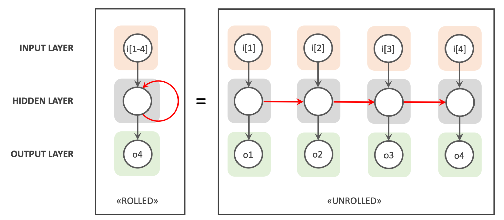

These architectures were (continue to be) widely used for NLP tasks, speech processing and time series. One area where RNN’s played an important role was in the development of machine translation systems, where the objective is to map a sequence of words in one language to another. This kind of task is usually tackled with an encoder – decoder or sequence to sequence (seq2seq) architecture, which is well suited for situations where the input and output are both sequences of arbitrary length. The job of the encoder is to encode the information from the input sequence into a numerical representation that is often called the last hidden state (context vector). This state is then passed to the decoder, which generates the output sequence one at a time. 

Although elegant in its simplicity, one weakness of this architecture is that the final hidden state of the encoder creates an information bottleneck: it has to represent the meaning of the whole input sequence in one long vector and this is all the decoder has access to when generating the output. This is especially challenging for long sentences, where information at the start of the sequence might be lost in the process of compressing everything to a single, fixed representation. As there may be too much detail and context to effectively encode in that single vector. 

Fortunately, there is a way out of this bottleneck by allowing the decoder to have access to all the encoder’s hidden states. This mechanism is to capture contextual information from the entire input sequence without a fixed-length bottleneck.  The general mechanism for this is called attention, and it is a key component in many modern neural network architectures. Understanding how attention was developed for RNN’s will put us in good shape to understand one of the main building blocks of the Transformer architecture. Transformers have become the foundation for many state of the art NLP models, like BERT and GPT-3, precisely because they mitigate the limitations described in the passage. They can handle longer sequences and capture information more effectively. 

## ATTENTION IS ALL YOU NEED 

The main idea behind attention is that instead of producing a single hidden state for the entire input sequence, the encoder outputs a hidden state at each step that the decoder can access. However, using all the states at the same time would create a huge input for the decoder, so some mechanism is needed to prioritise which states to use. This is where attention comes in, it lets the decoder assign a different amount of weight or “attention” to each of the encoder states at every decoding time step.

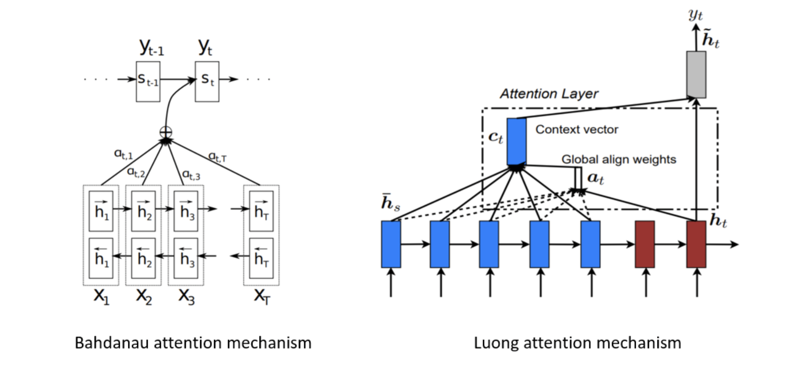

By focusing on which input tokens are most relevant at each time step, these attention based models are able to learn non–trivial alignments between the words in a generated translation and those in a source sentence. This figure below visualises the attention weights for an english to french translation model , where each pixel denotes weight. 

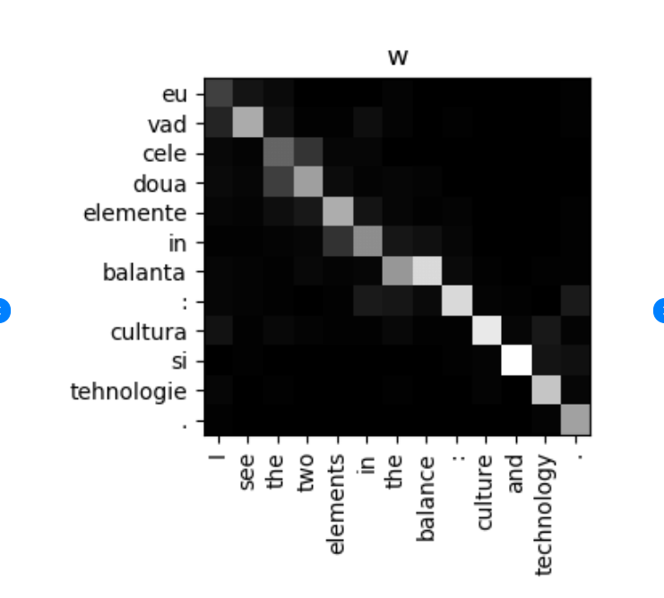

## DEEP DIVE IN TO ATTENTION MECHANISMS

Attention is a mechanism that was developed to improve the performance of the encoder decoder RNN on machine translation. The RNN is composed of two sub models, which are encoder and decoder. The encoder is responsible for stepping through the input time steps and encodes the entire sequence into a fixed length vector called a context vector. And the decoder is responsible for stepping through the output time steps reading from the context vector.

Attention is proposed as a solution to the limitation of the encoder decoder model, encoding the input sentences to one fixed length vector from which to decode each output time step. This issue is believed to be more of a problem when decoding long sentences.  A potential issue with this encoder decoder approach is that a neural network needs to be able to compress all of the necessary information of a source sentence into a fixed length vector. This may make it difficult for the neural network to cope with long sentences, especially that are longer than sentences in the training corpus. 

We introduce an extension to the encoder and decoder model which learns to align and translate jointly. Each time the proposed model generates a word in a translation, it searches for a set of positions in a source sentence where the most relevant information is concentrated. The model then predicts a target model based on the context vectors and all the previous generated target words. 

## THE PROBLEM OF LONG SENTENCES 

So given a very much long french sentence like :- 

“Jane s’est rendue en Afrique en septembre dernier a apperciela et a rencontre beaucoup degens merveilleux ; elleest revenue en parlent comment son voyage etait mekeilleux , et elle me tente d’y aller aussi”.
Now, we are instructing the encoder neural network to read the entire sentence, memorize it, and then store it in its activations. After this, the decoder neural network generates the English translation.
Now the way human translator would translate the sentence is not to first read the whole french sentence and memorise the whole thing and then regurgitate an english statement from scratch but instead what a human translator would do is read the first part of it may be generate part of the translation and look the second part, generate a few more words and so on. We kinda work part by part through the sentence because it is just really difficult to memorize the whole long sentence, and so what we see for the encoder decoder architecture is that it works quite well for short sentences but for every long sentences may be longer than 30 or 40 words, the performance comes down. 

## FORMALIZE THE ATTENTION MODEL INTUITION

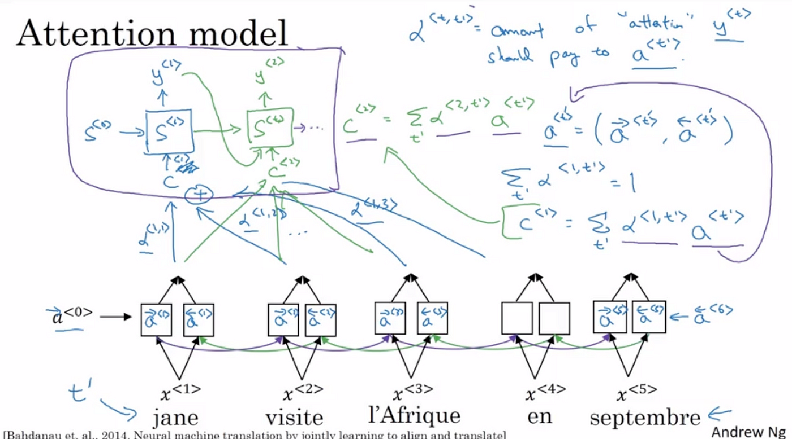

Let’s use a bi-directional RNN in order to input and compute some set of features for each of the input words. Here we drew the standard bidirectional recurrent neural network with the outputs y<1> … y<5> and computed a very rich set of features about the word in the sentence or maybe surrounding words. 

Now the question is when we are trying to generate the first word (“Jane”), what part of the French input sentence should we be looking at? So what the attention model would be computing is a set of attention weights and we’re going to use α<1,1> to denote to generate the first word, i.e how much should we pay attention to the piece of information that we get from the first word x<1>

And we also come up with a second attention weights, let’s call it α<1,2> which tells us while we are trying to compute the first word “Jane” how much attention should be paying to this second word from the input sequence and so on and this will tell us, what is exactly the context c[1] we should be paying attention to and that is input to our first decoder recurrent neural network unit and then try to generate the first word. 

Questions :- 

   • How exactly is this context defined ? 
     
   • How do we compute this attention weight alpha ? 
  
   • How does the attention model solve the problem of the encoder and decoder, in the translation of longer sentences ?

The α<t,t’> allows it on every time step to look only at a local window of the French sentence to pay attention to when generating a specific English word. Now, let’s formalize the attention model. And for the forward recurrence we would have a(forward)  and a(backward) for the backward recurrence. Technically, a<o> in the forward step and a<6> for the backward step will be a vector of zeros and at every time step even though we have the features computed from the forward recurrence and from the backward recurrence in the bi-directional RNN (a<0> forward , a<6> backward), we are going to use a<t’> for both of these concatenated together. 

        a<t’> = (a<t’> forward + a<t’> backward)

We are saying t’ to denote that it is a french sentence and this is going to be a feature vector for the time step t’ in both forward and backward direction. So the way we define the context is actually to sum the features from different time steps weighted α<t’> this attention weight. 

So more formally the attention weights will satisfy this 
                    
 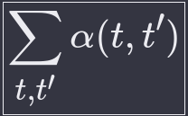

The alpha must be non-negative and they are summed to 1 and we will have the context at time step 1 like this :- 

The context is going to be the sum over t’, weighted sum of the activation function with the attention weights. Where the activation function a<t’> = (a<t> , a<t’>).  In other words, when we are generating the output word, how much should we pay attention to the ' t’ ' input word. 

So using the context vector the above network “s” looks like a standard recurrent neural network with the context vector as input and we can just generate the translation one word at a time. 
HOW DO WE CALCULATE THE ATTENTION WEIGHTS ?

So the only remaining thing to do is to define how to actually compute these attention weights. So just to recap , alpha (t , t’) is the amount of attention we should pay to a<t’> , when we are trying to generate the words in the output translation. 

Alpha <t,t’> = amount of attention y<t> should pay to a<t’>, the figure below shows the formula we use to compute alpha <t,t’> 

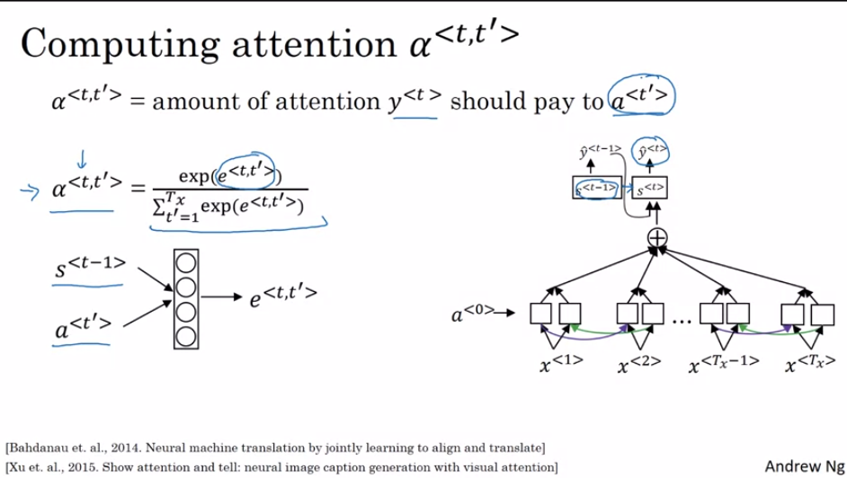

This is essentially a softmax, to make sure that these weights sum to one if we sum over t’. Now how do we compute the attention weights ? Well one way to do so is to use a small neural network. So s<t-1> was the neural network from the previous time step. So if we are generating y<t> then s<t-1> will be the hidden state from the previous time step that just falls into s<t> and that is one input to a very small neural network. This is usually one hidden layer in neural network because we need to compute these a lot and then a<t’> the features from time step t’ is the other inputs and the intuition is, if we want to decide how much attention to pay to the activation of t’, well the things that will depend the most on is, what our hidden state activation from the previous time step and the activations of the encoder. We don’t have the current state of activation yet because of context feeds in to this so we haven’t computed that but look at whatever our hidden translation and then for each of the positions, so it seems pretty natural that alpha <t,t’> and e<t,t’> should depend on these two quantities. 

This is essentially a softmax, to make sure that these weights sum to one If we sum over t’. But the problem is we don’t know what the function is, so one thing we could do is just train whatever this function should be and trust back propagation, trust gradient descent to learn the right function. This neural network does a pretty decent job telling us how much attention y<t> should pay to a<t> and this formula makes sure that the attention weights sum to one.

## ATTENTION MODELS FOR IMAGE CAPTIONING 

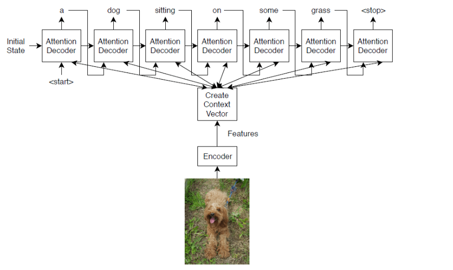

How does the attention model enable us for the image captioning purpose ? These also applied to other problems as well as Image Captioning, the task is to look at the picture and write any caption for that picture.  We could have a very similar architecture, look at the picture and pay attention only to part of the picture at a time while you’re writing a caption for the picture. 

## THE PROBLEM WITH ATTENTION MECHANISM 

Although attention enabled the production of much better translations, there was still a major shortcoming with using recurrent models for the encoder and decoder : the computations are inherently sequential and can not be parallelized across the input sequence. 

## SELF ATTENTION MECHANISM

Questions :- 

    • What is self attention ? 
      
    • What makes self attention different from the original attention mechanism ? 
      
    • How is self attention embedded in the transformer network ? 
      
    • How does parallel computing work ? 

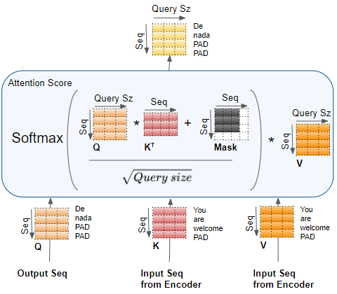

As the complexity of our sequence task increases, so does the complexity of our model. We have started with RNN, found that it had some problems with vanishing gradients , which made it hard to capture long range dependencies and sequences.We then looked at the GRU and then LSTM model as a way to resolve many of those problems where we may use gates to control the flow of information. While these models improve to control the flow of information, they also come with increased complexity. so as we move from our RNN’s to GRU to LSTM the models became more complex and all of these models are still sequential models in that they ingested may be the input sentence one word at the time and so, as if each unit was like a bottleneck to the flow of information because to compute the final unit for example we first have to compute the outputs of all the units that came before. So for this we will learn a transformer architecture, which allows us to run a lot more of these computations for the entire sequence in parallel, so we can ingest an entire sentence all at the same time rather than just processing it one word at a time from left to right. 

So what we see in the attention network is a way of computing a very rich and useful representation of words but with something more akin to the style of parallel processing. 

To understand transformer network, we must first see two basic concepts :- 

    • Self attention 
    • Multi-Head Attention 

The goal of self attention is, if we have say a sentence of five words, we will end up computing five rich representations for this five words, was going to write A<1> , A<2> , A<3> , A<4> , A<5> and this will be an attention based way of computing representations for all of the words in a sentence in parallel. Then the multi head attention is basically a for loop over the self attention process so we need up with multiple versions of these representations and it turns out these can be used for machine translations or other NLP tasks to create effectiveness. So first let’s see self attention which provides a very rich representation of the words. 

**Let’s use our running example :-**

        X<1>      X<2>          X<3>             X<4>              X<5>

        Jane      Visite           l’Afrique         en             Septembre

The running example we are going to use is take the word l’Afrique in this sentence then we will step through on how the transformer network’s self attention mechanism allows us to compute A<3> for this word and then the same thing for other words in the sentence as well. Now as we know, one way to represent l’Afrique would be to just look up the word embedding for l’Afrique or Africa as a site of historical interests or as a daily destination or as a world’s second largest content. 

Depending on how we’re thinking of l'Afrique we may choose to represent what A<3> will do. It will look at the surrounding words to try to figure out what’s actually going on in how we’re talking about Africa in this sentence and find the most appropriate representation for this. In terms of the actual attention calculation, it won’t be too different from the attention mechanism formula as applied to the context of RNN’s except we will compute these representations in parallel for all five words in a sentence. 

The main difference is that in every word we have  three values called the query, key and value; these vectors are the key inputs to computing the attention value for each word. Our first step is we are going to associate each of the words with values called query, key and value pairs. We are going to see how well the queries and keys match, but all of them (q , k , v) are vectors. 

Question:-

    • What does q,k,v represent in the self attention mechanism of the Transformer Architecture ?

In the self attention mechanism of the Transformer architecture q , k , and v are known as the query, key and value vectors respectively. 

- The query vector (q) represents the vector of the current input word/token in the self attention mechanism.

- The key vector (k) represents the vector of all other words / tokens in the same sequence, which are used to compute the attention weights.

- The value vector (v) represents the vector that is used to weigh the importance of each key based on its relevance to the current input word/token.

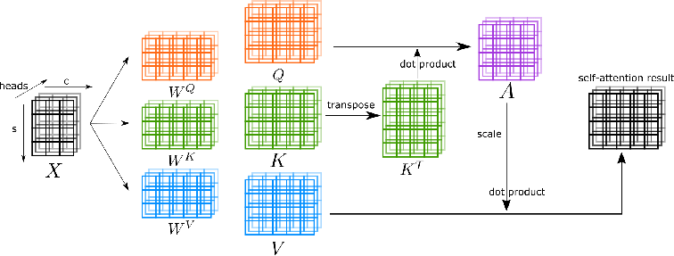

The attention weights are computed by taking the dot product of the query vector with all the key vectors, and then normalizing the resulting scores using the softmax function. These weights are then used to weigh the corresponding value vectors, which are summed up to obtain the output of the self attention mechanism.

If X<3> is the word embedding for l’Afrique, the way this vector is computed is a learned matrix. 

        Q<3> = Wq X<3>
        K<3> = Wk X<3>
        V<3> = Wv X<3>

These matrices Wq , Wk , Wv  are parameters of this learning algorithm and they allow you to pull these query, key and value vectors for each word but what are these query, key and value. We can think of them as a loose analogy to databases where we can have queries and key – value pairs.  

        X<1>  X<2>       X<3>       X<4>      X<5>

        Jane    Visite       l’Afrique      en        Septmbre

q<3> is a question that we get to ask about l’Afrique, so q<3> may represent like , what is happening there ? Is it a destination ? So what we are going to do is compute the inner product between q<3> and k<1> and this will tell us how good is an answer to the question of what’s happening in Africa and then we will compute the inner product between q<3> and k<2> and this intended to tell us how good is “visite” an answer to the question of “what Is happening in Africa” and so on for the other words, in the end the goal of this operation is to pull the most information that is needed to help us compute the most useful representation A<3>. 

So if K<1> represents that this word is a person because Jane is a person and K<2> represents that the second word, visite is an action, then we may find that k<2> has the largest value and this intuitive example might suggest that visite gives more relevant context for what’s happening Africa, which is it’s viewed as a destination for a visit. 

So what we will do is take five values (q<3>k<1> , q<3>k<2>, q<3>k<3> , q<3>k<4> , q<3>k<5>) in and compute the softmax over them and in our example q<3>k<2> corresponding to word visite may be the largest value (that is why we are making that part of the word bold). 

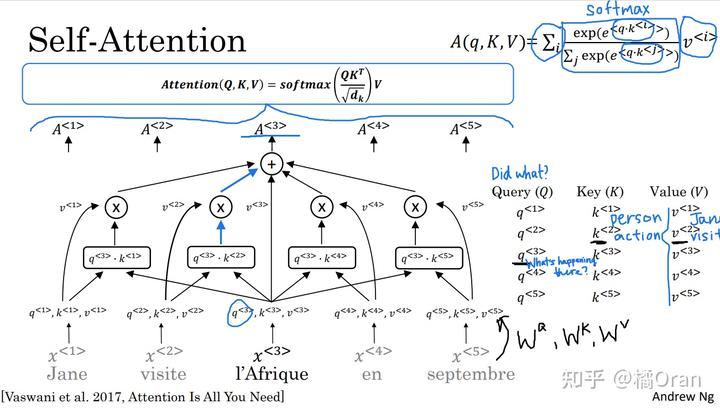

Now after computing the softmax , we are going to multiply with the value vector for each word and then finally we sum it up and so all of these values will give us A<3>. And then we are going to multiply with the value vector for each word and then finally we sum it up.

After computing the softmax over the dot products between the query and key vectors, the attention mechanism weights corresponding value vectors and sums them up to obtain the final output of the self attention mechanism. This is done to compute a weighted average of the values, where the weights are given by the attention scores (The weights are given by the attention scores , by weighted summing it with the value vector we will obtain the output of the self attention mechanism) 

The intuition behind this operation is that the attention scores tell us how much importance the model should place on each value vector when computing the output.  By  weighting the value vectors with their corresponding attention scores and summing them up, we obtain a representation of the input that is focused on the most relevant parts of the sequence. 

So another way to write A<3> is really as A(q<3> , K , V) and the key advantage of this representation is the word l’Afrique isn’t some fixed word embedding but instead, It let’s the self attention mechanism realize that l’Afrique is the destination of a visite and this is a richer and more useful representation for this word. 

Now we have been using the third word, l’Afrique as a running example, but we could use this process for all the five words in our sequence to get similarity-rich representations for Jane , l’Afrique , en , septembre. If we put all of these five computations together, denotation used in literature looks like this, where we can summarize all of these computations that we just talked about for all the words in the sequence by writing attention (Q , K , V) where Q , K , V matrices with all of these values , and this is just a compressed or vectorized representation of our equation. 

## SCALED DOT PRODUCT ATTENTION

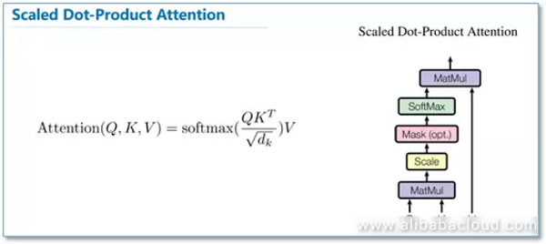

**MatMul (Matrix Multiplication)**: This is the first operation in the attention mechanism. It multiplies the Query matrix with the transpose of the Key matrix. The result is a matrix of scores that represent the similarity between each query and key.

**Scale**: The scores are scaled down by dividing by the square root of the dimensionality of the key vectors (dk​​). This is done to prevent the softmax function from having a very small gradient, which can occur if the dot products are very large. The scaling helps in stabilizing the gradients during training.

**Mask (Optional)**: In some instances, particularly in the decoder, a mask is applied to the scaled scores to prevent attention to future tokens. This step is critical for training the model in a way that respects the autoregressive property, ensuring that the prediction for a given position can only depend on known outputs at previous positions.

**SoftMax**: The softmax function is applied to the scores, typically along each row. This normalizes the scores so they can be interpreted as probabilities, allowing the model to effectively decide how much each value should be attended to.

**MatMul (Matrix Multiplication)**: The softmax probabilities are then used to create a weighted sum of the value vectors. This is done by multiplying the normalized scores with the Value matrix V. The result is the output of the attention layer, which is a matrix where each row is a weighted sum of the value vectors, with the weights reflecting the relevance of each key to the query. 

## THE DIMENSION OF SELF ATTENTION 

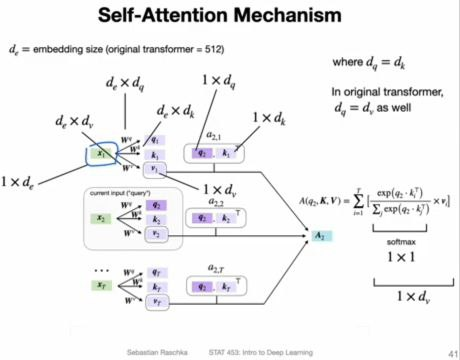

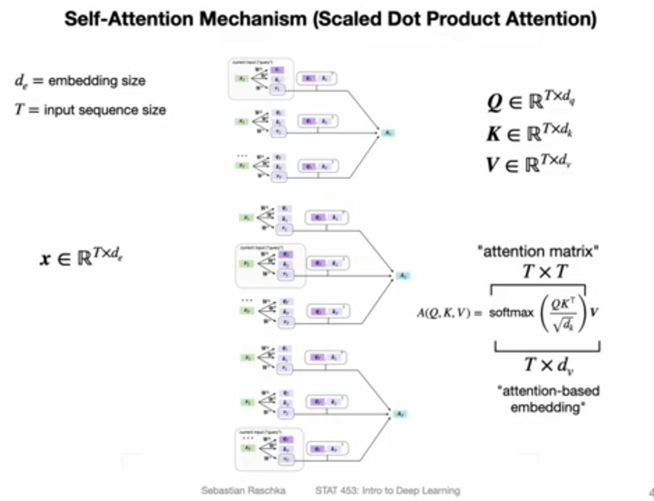

## MULTI-HEAD ATTENTION MECHANISM 

Multi head attention is basically a big for loop over the self attention mechanism that we learned before, and each time we calculate the self attention for a sequence is called a head and the name multi head attention refers to a normal self attention but a bunch of times. 

Remember that we got the vectors Q , K and V for each of the input terms, multiplying them by a few matrices Wq , Wk , Wv. So with the computation the word visite gives the best answer to the query “what’s happening ” which is why we highlighted with the blue arrow to represent that the inner product between the key for l’Afrique has the highest value with the query for visite. So this is how we get the representation for l’Afrique and we do the same for Jane, visite and for other words. So we end up with five vectors to represent the five words in the sequence. So this is a computation to carry out for the first of the several heads we use in multi head attention. And so we would step through exactly the same calculation that we had just now for l’Afrique and for other words and end up  with the same attention values , A<1> through A<5>, but now we’re going to do this not once but a handful of times. So rather than having one head , we may now have eight heads, which just means performing this whole calculation eight times. 

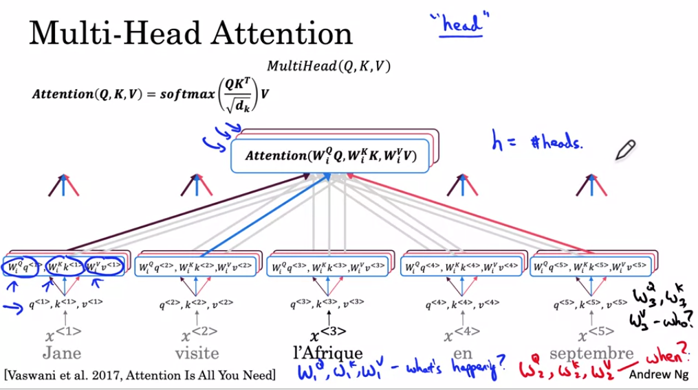

Now let’s do this computation with the second head, the second head will have a new set of matrices, we are going to write Wq2 , Wk2 , Wv2, this mechanism helps us to ask and answer a second question. So the first question was “what’s happening” maybe the second question is “when something is happening” and so instead of having w1 here, in general case we will have wi and we’ve now stacked up the second head behind the first one, which is the red one. So we repeat a computation that is exactly the same as the first one but with this new set of matrices instead and we end up with in these may be the inner product between the September  key and the l’Afrique query will have the highest inner product, so we are going to highlight by a red arrow to indicate that the value for September will play a larger role in this second part of the representation for l’Afrique. 

Maybe the third question we now want to ask as represented by wq3 , wk3 , wv3 is, “who has something to do with Africa ?” And in this case when we do this computation for the third time, maybe the inner product between Jane’s key vector and the l’Afrique query vector will be the highest and self highlighted this is a black arrow. So that Jane’s value will have the greatest weight in this representation which we have stacked on at the back. In the literature, the number of heads is usually represented by the lower case h, and so h is equal to the number of heads. 

And we can think of each of these heads as a different feature, and when we pass these features to a new network we can calculate a very rich representation of the sentence. Calculating this computations for the three heads or the eight heads or whatever the number, the concatenation of these three value or 8 values is used to compute the output of the multi head attention and so the final value is the concatenation of all of these h heads and then finally multiplied by a matrix W0.

Questions :-
 
    • How does the concatenation work ?
    • What is the point of multiplying it by Wo ?

So doing self attention multiple times, we now understand the multi-head attention mechanism, which lets us ask multiple questions for every single word and learn a much richer and much better representation for every word. 

In the context of multi-head attention, the concatenation process is all about combining the outputs from multiple 'heads' of the attention mechanism. Each head performs attention independently so that the model can focus on different parts of the input sequence simultaneously. After each head has produced its output (usually a weighted sum of the input values), these outputs are concatenated together to form a single matrix. This allows the model to integrate information from different representational spaces.

In the context of the attention mechanism, after the outputs from different heads are concatenated, they are usually passed through a linear transformation to project them back into the original input space or to another desired dimensionality. Wo likely represents the weight matrix of the output linear layer that follows the concatenation step. This weight matrix is part of the linear transformation that maps the concatenated outputs from the multi-head attention back to the desired dimensionality. The subscript 'o' typically stands for 'output'. This matrix is learned during the training process and is key to integrating the information processed by the different attention heads.

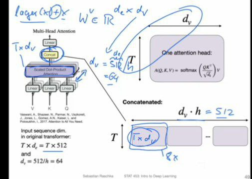

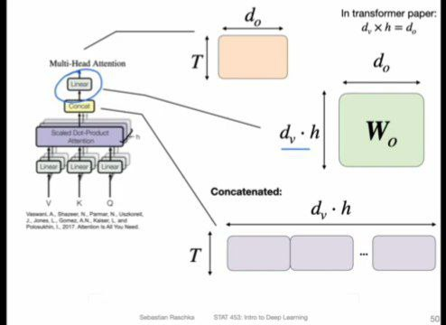

Let’s say that the concatenated attention outputs have a shape (batch_size , sequence_length(T) , num_attention_heads(h) * attention_head_size(dv)) , where num_attention_heads is the number of attention heads and attention_head_size is the dimensionality of each attention head output. The weight matrix W0 has a shape of (num_attention_heads(h) * attention_head_size(dv) , output_dimension ) , where output_dimension is the desired dimensionality of the final output. 

        Wo = (h*dv , output_dimension)
        concat * wo = Linear transformed output
        (T , h*dv) * (h*dv , output_dimension) = (T*output_dimension)
        

To compute the linear transformation , we first reshape the concatenated attention outputs in to a 2D tensor of shape (batch_size * sequence_length , num_attention_heads * attention_head_size) , then we multiply this tensor by the weight matrix W0 , resulting in a tensor of shape (batch_size * sequence_length  , output_dimension)

Finally , we reshape this tensor back to the original shape of (batch_size , sequence_length , output_dimension) to obtain the final output of the multi-head self attention layer. This linear transformation can be thought of as a weighted sum of the input features , where the weights are learned by the model during training. 

In summary , multiplying the concatenated attention outputs by a weight matrix W0 creates a linear transformation because it is a linear combination of the input features and learnable parameters of the weight matrix. 

## THE TRANSFORMER ARCHITECTURE 

   

Questions:-

    • What is the transformer architecture ?
      
    • Why do we need it ?
      
    • How does the transformer architecture work ?
      
    • What features of transformers change the world of NLP by storm  ? 
    • How does the transformer architecture learn long – range dependencies, capturing the relationship between words that are far apart in the input sentence?

We already familiarized ourselves with the concept of self attention as implemented by the transformer attention mechanism for neural machine translation. We will now be shifting our focus to the details of the Transformer Architecture itself to discover how self attention can be implemented without relying on the use of recurrence and convolution. 

The transformer architecture uses several mechanisms to learn long – range dependencies and capture relationships between words that are far apart in the input sentence. 

1) **Self attention** :- The Transformer uses a self – attention mechanism that allows each word in the input sentence to attend to all the other words in the sentence , regardless of their position. This mechanism enables the model to capture long -range dependencies by giving it the ability to focus on relevant information in the sentence , even if it is far away from the current word being processed.

2) **Multi – Head Attention** :- The Transformer also uses multi – head attention , which is a variation of self attention that allows the model to attend to different aspects of the input sentence at the same time.

3) **Positional Encoding** :- The Transformer uses positional encoding to inject information about the position of each word in the input sentence. This allows the model to differentiate between words that are far apart in the sentence and helps it learn long range dependencies.

4) **Layer Normalization** :- The Transformer uses layer normalization to normalize the activations of each layer in the model. This helps to reduce the impact of vanishing gradients and ensures that the model can capture long – range dependencies.

5) **Stacked Layers** :- The Transformer uses a stack of multiple layers , each with its own self attention and feed – forward layers. This enables the model to capture increasingly complex relationships between the words in the input sentence and helps it learn long range dependencies. 

## POSITIONAL EMBEDDING 

An important consideration to keep in mind is that the Transformer architecture can not inherently capture any information about the relative position of the words in the sequence since it does not make use of recurrence. This information has to be injected by introducing positional encoding to the input embeddings. 

The positional encoding vectors are of the same dimension as the input embeddings and are generated using sine and cosine functions of different frequencies. Then, they are simply summed to the input embeddings in order to inject the positional information.

Question :- 

    • How does the positional encoding work ? 
    • How are sine and cosine functions used for generating the vectors of the positional embedding ? 

In languages, the order of the words and their position in a sentence really matters.  The meaning of the entire sentence can change if the words are re-ordered. When implementing NLP solutions, recurrent neural networks have a built mechanism that deals with the order of sequences. The transformer model however does not use recurrence or convolution and treats each data point as independent of the other. Since the Transformer architecture ditched the recurrence mechanism in favour of multi-head self attention mechanism. Avoiding the RNN’s methods of recurrence will result in massive speed up in the training time and theoretically, it can capture longer dependencies in a sentence. 

The Transformer architecture, introduced in the paper “Attention is All You Need” by Vaswani et al(2017), replaces the recurrent neural network (RNN) mechanism typically used in sequence to sequence models with self attention mechanisms, which enables parallelization of computation. In traditional RNN, the hidden state at each time depends on the hidden state of the previous time step, which makes the computations sequential and not easily parallelizable. This can limit the performance of the model on longer sequences, since each time step must wait for the previous time step to compute.

In contrast, the Transformer architecture utilizes a self attention mechanism, which allows the model to process all input tokens in parallel. Specifically, the model computes the attention score for each token in the input sequence based on its relationship with every other token in the sequence. The attention scores are used to weigh the importance of each token, which are then used to compute a weighted sum of all tokens in the sequence. This weighted sum, which captures the most relevant information from the input sequence, is then used as input to the subsequent layers of the model. 

Since the attention mechanism considers all tokens in the input sequence in parallel, the Transformer architecture is more efficient and faster than traditional RNNs, and can process longer sequences without sacrificing performance. Additionally, the Transformer architecture has become a popular choice for various natural language processing tasks such as machine translation,text generation, and language understanding, due to its superior performance and parallelizability. Here, positional information is added to the model explicitly to retain the information regarding the order of words in a sentence, positional encoding is the scheme through which the knowledge of the order of objects in a sequence is maintained. 

## HOW POSITIONAL ENCODING WORKS

The Transformer architecture uses a positional encoding mechanism to inject position information into the input sequence so that the self attention mechanism can differentiate between tokens based on their position in the sequence. Since the self attention mechanism in the Transformer does not consider the order of the input sequence, it is important to incorporate the position of each token into the input representation. The positional encoding achieves this by adding a vector to the embedding of each token that encodes the position in the sequence. 

The positional encoding vector is a fixed, sinusoidal function of the position, which is added to the input embeddings. Specifically , the positional encoding is calculated as follows :- 

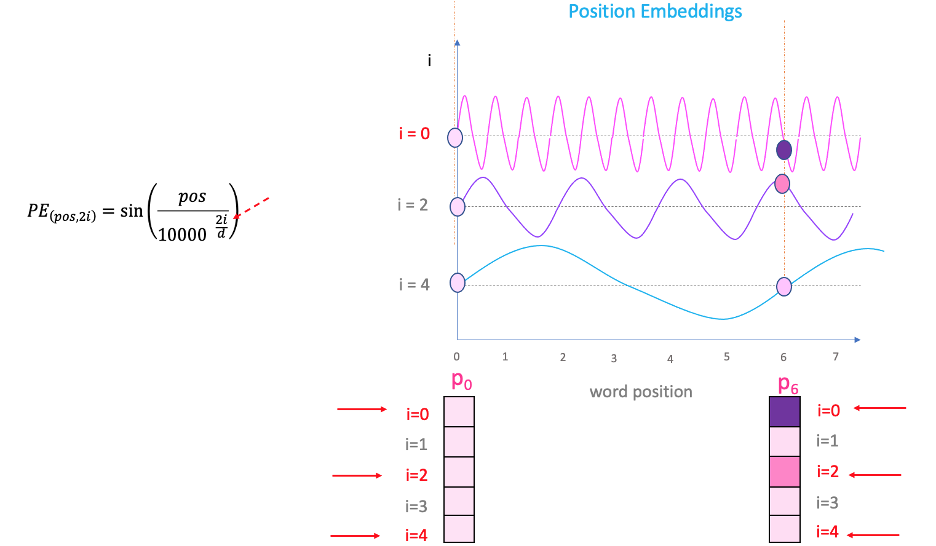

Where “pos” is the position of the token in the sequence , “I” refers to the position along the embedding vector dimension and “d_model” is the dimension of the embedding. Each dimension of the positional encoding corresponds to a different frequency of the sinusoidal function. By using different frequencies, the model can distinguish between tokens based on their position in the sequence. 

The positional encoding is added to the input embedding at the beginning of the network and the resulting vectors are fed to the self attention layers. The self attention mechanism can then differentiate between tokens based on both their semantic meaning and their position in the sequence. The positional encoding mechanism allows the Transformer to incorporate positional information into the input sequence without disrupting the parallelizability of the model. 

Question:-

    • Why do we use a sinusoidal function for generating the positional encoding ? 

The Transformer architecture uses a sinusoidal function for generating positional encodings because it provides a fixed, continuous encoding for each position in the sequence that is easily learnable by the model. A key requirement of the positional encoding function is that it must be fixed and known in advance, so that it can be added to the input embeddings before the model is trained. The use of a fixed positional encoding allows the model to generalize well to input sequences of different lengths and extrapolate to longer sequences during inference. 

The choice of sinusoidal function is motivated by the fact that it is a continuous, periodic function that can represent any position in the sequence with a unique encoding. This ensures that each position in the sequence is mapped to distinct encoding , which is important for the self attention mechanism to distinguish between different positions. 

Moreover, the choice of sinusoidal function with different frequencies ensures that each dimension of the encoding captures different aspects of the position information. Specifically, each dimension of the encoding corresponds to a different frequency of the sinusoidal function, allowing the model to capture positional information at different scales. The use of sinusoidal function allows the positional encoding to be easily computed and added to the input embeddings using simple mathematical operations. This enables efficient computation and fast training of the Transformer model. 

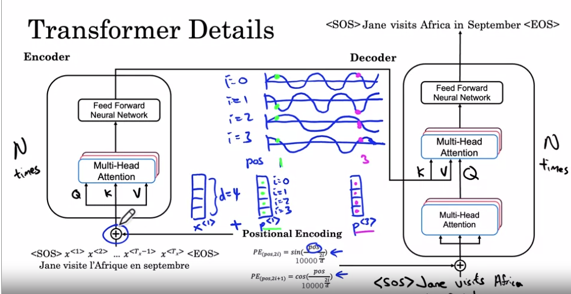

## THE FORMULA OF POSITIONAL EMBEDDING 

So what we are going to do is, we are going to embed some arbitrary word and then we are going to have a positional encoding for the arbitrary location and then we are going to add the two together and this is going to give us our encoding that we are going to send to our first layer of the encoder. Positional encoding does not depend on the feature of any word, we are not looking at the word itself , we are only looking at the position of the word. 

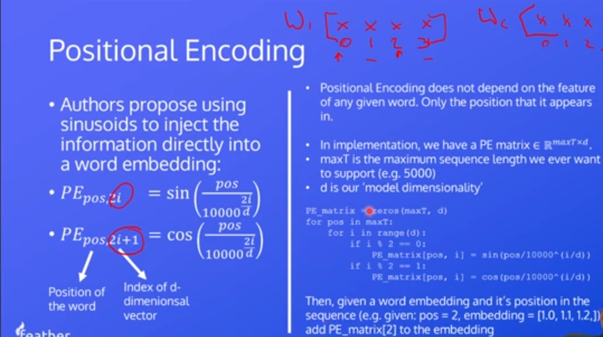

So our positional encoding formula uses sines and cosines and in the formula pos refers to the position of the word and “I” refers to the index of a hidden vector. So in the first formula , 2i refers for the even index of the vector and in the second formula 2i + 1 refers for odd index of the vector. So for all of the even indexes in the word one , we will use the first formula by making the position (pos) = 1  and for all of the odd indexes in the word one , we will use the second formula by making the position (pos) = 1

Question :- 
    
    • Why do we use sine for even indices and cos for odd indices ?

In the positional encoding used in the transformer model in natural language processing , sine and cosine functions are used to generate different positional embeddings for each position in a sequence. Specifically , sine and cosine functions with different frequencies are used to encode the position of each token in the sequence. 

The choice of using sine for even indices and cosine for odd indices is somewhat arbitrary , but it ensures that the positional embeddings generated for adjacent positions are different enough from each other to provide unique information to the model. If we used the same function for all positions , the model may not be able to distinguish between adjacent positions. 

By using sine and cosine functions with different frequencies , we can ensure that the positional embeddings for each position are unique and can be easily distinguished by the model. 

Question:-

    • Why do we need the denominator to be 10000 ? 

The reason we use "10000" in the formula is to make sure each word gets a very distinct wave pattern. Imagine if each word in a sentence was given a unique sound wave—words closer to the beginning of the sentence would have slower waves, and words towards the end would have faster waves. By using "10000," we're able to create a wide range of these waves, so each position from the first word to the last gets a unique pattern. This helps the Transformer model understand which word comes first, which comes second, and so on, without getting confused. In other words, "10000" helps create a broad spectrum of unique position signals so the model can learn the order of words effectively.

If it is small the frequency will be higher and the cyclic repetition would be faster(the period for being a cycle will be smaller ( faster ) since frequency and  period are inversely proportional ). This increases the probability of positional encoding of different positions to be similar. Large omega increases the probability that different positions will have unique encodings. 

## THE ENCODER OF THE TRANSFORMER ARCHITECTURE 

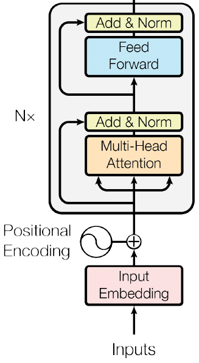

The encoder consists of a stack of N = 6 identical layers , where each layer is composed of two layers. 

1) The first sub layer implements a multi – head self attention mechanism. We have seen that the multi head mechanism implements h heads that receive a different linearly projected version of the queries , keys and values , each to produce h outputs in parallel that are then used to generate a final result.

2) The second layer is a fully connected feed forward network consisting of two linear transformations with Rectified Linear Unit (ReLU) activation in between.

FFN(x) =ReLU(w1x + b1) w2 + b2

Question :- 
    
    • Why do we need this repeated six layers ? 

The Transformer architecture for natural language processing tasks includes both an encoder and decoder. The encoder is responsible for processing the input sequence , while the decoder generates the output sequence. The encoder uses a stack of N identical layers , where N is typically set to 6 or more. There are several reasons why a stack of multiple layers is needed in the encoder :- 

1) **Capturing complex dependencies** :- Each layer in the encoder can capture different levels of abstraction in the input sequence. The lower layers capture simple dependencies between nearby tokens , while the higher layers capture more complex and long – range dependencies. By stacking multiple layers , the model can capture increasingly complex relationships between tokens , allowing it to model sophisticated representations of the input sequence.

2) **Robustness to noise** :- Stacking multiple layers in the encoder can also help make the model more robust to noise and variations in the input sequence. Each layer can perform different type of processing on the input , allowing the model to  learn multiple representations of the same input. This can help the model to identify and filter out noise in the input , making it more robust to variations and errors. 

3) **Depth of the model** :- Stacking multiple layers in the encoder also increases the depth of the model. Deeper models can learn more complex functions and capture more intricate relationships between input and output. This can lead to better performance on a variety of natural language processing tasks.

So the stack of N = 6 , identical layers in the encoder of the Transformer architecture is needed to capture increasingly complex and long – range dependencies in the input sequence , make the model more robust to noise , and increase the depth of the model to learn more complex functions. 

Question:- 

    • What advantage will they give when the weights differ in those six layers ? 

Since each layer can perform different types of processing on the input , it allows the model to learn multiple representations of the same input. The six layers of the transformer encoder apply the same linear transformations to all the words in the input sequence , but each layer employs different weight ( w1 , w2 ) and bias ( b1 , b2 ) parameters to do so. 

Question :-

    • What is the advantage of the residual connection in the transformer architecture ? 

The residual connection is an important component of the Transformer architecture for natural language processing tasks , including in the encoder part. The residual connection adds the original input to the output of each sub – layer in the Transformer layer, allowing information from the original input to flow through to the output of the layer. This has several advantages 

1) **Gradient propagation** :- The residual connection allows gradients to flow more easily through the network during training. Without the residual connection , gradients can diminish as they pass through multiple layers of the network , making it harder to train deep neural networks. With the residual connection , the gradients can flow more easily through the network , making it easy to train deeper models.

2) **Stabilization** :- The residual connection helps stabilize the learning process by preventing vanishing gradients. The residual connection allows information from the original input to be preserved in the output of each layer , preventing the gradients from becoming too small and vanishing. This can help prevent the model from getting stuck in local minima during training.

3) **Feature reuse** :- The residual connection allows the model to reuse features from earlier layers in the network. By adding the original input to the output of each layer , the model can reuse features from earlier layers that are still relevant from the current layer. This can help reduce the number of new features that need to be learned in each layer , which can be especially beneficial when working with limited amounts of data.

In summary , the residual connection in the encoder part of the Transformer architecture provides several advantages , including improved gradient propagation , stabilization of the learning process , and feature reuse. These advantages can help the Transformer architecture achieve state of the art performance on a wide range of natural language processing tasks. 

Question :- 

    • How are we going to add the skip connection mathematically ? 

Each sub layer is also succeeded by a normalization layer , layer norm (.) , which normalizes the sum of computed between the sub layer input x and the output generated by the sublayer(x)

        layer norm (x + sub layer(x))

Question :-

    • What feature will this normalization add ? 

The transformer architecture for natural language processing tasks includes layer normalization in the encoder part , specifically in each sub – layer of the Transformer layer. Layer normalization has several advantages.

1) **Improved training stability** :- Layer normalization helps to stabilize the training process of the Transformer network by reducing the internal covariate shift. Covariate shift refers to the change in the distribution of the input to a layer , which can make the training process unstable. By normalizing the inputs to each layer , layer normalization reduces the internal covariate shift and stabilizes the training process.  

2) **Improved generalization** :- Layer normalization can improve the generalization of the model by reducing overfitting. Overfitting occurs when a model learns to fit the training data too closely, resulting in a poor performance on new, unseen data. Layer normalization can help prevent overfitting by reducing the impact of small changes in the input, which can lead to more robust and generalizable models. 

3) **Improved Performance** :- Layer normalization has been shown to improve the performance of the Transformer network on various natural language processing tasks. By reducing the internal covariate shift and improving the generalization of the model, layer normalization can lead to better performance on tasks such as machine translation, language modelling and text classification.

Normalization can help prevent overfitting in neural networks by reducing the impact of small changes in the input. Overfitting occurs when a model becomes too complex and learns to fit the training data too closely, resulting in poor performance on new, unseen data. Normalization can help prevent overfitting by reducing the sensitivity of the model to small changes in the input, which can lead to more robust and generalizable models. 

In neural networks , small changes in the input can have a large impact on the output of the network, especially in deep networks with many layers. Normalization can help reduce the impact of these small changes by scaling the input to each layer so that it has zero mean and unit variance. This can help reduce the sensitivity of the network to small changes in the input, making it more robust to variations in the training data. 

By reducing the impact of small changes in the input, normalization can help prevent overfitting by encouraging the model to learn more generalizable features that are less sensitive to small variations in the training data. This can help the model perform better on new, unseen data, which is the ultimate goal of machine learning. 

In summary , normalization helps prevent overfitting by reducing the sensitivity of the model to small changes in the input, which can lead to more robust and generalizable models. 

In summary, layer normalization in the encoder part of the Transformer architecture provides several advantages, including improved training stability, improved generalization, and improved performance on natural language processing tasks. These advantages can help the Transformer architecture achieve state of the art performance on a wide range of natural language processing tasks. 

Question :-
    
    • What is the advantage of the fully connected neural networks ? 

The Transformer architecture for natural language processing tasks includes a fully connected neural network in the encoder part, specifically in each Transformer layer. This fully connected network is known as the “ feed forward network ” and has several advantages. 

1) **Non – linear transformation** :- The feed forward network applies a non – linear transformation to the output of the self – attention  layer in each Transformer layer. This non – linearity allows the model to learn complex relationships between tokens in the input sequence, which can be critical for natural language processing tasks.

2) **Dimensionality Reduction** :- The feed forward network reduces the dimensionality of the output of the self – attention layer, which can help reduce the computational cost of the Transformer architecture. The self – attention layer outputs a matrix with dimensions corresponding to the number of tokens in the input sequence, which can be very large for long input sequences. The feed forward network reduces the dimensionality to a smaller, fixed size, which can be more computationally efficient to process in subsequent layers. Prove this mathematically ?

3) **Multi Modal Processing** :- The feed forward network can be used to incorporate other types of features into the Transformer architecture, in addition to the token embeddings. For example, in some natural language processing tasks, it may be useful to incorporate information about the part of speech or name entity type of each token. The feed forward network can be used to process these additional features and integrate them into the representation learned by the Transformer.

In summary , the feed forward network in the encoder of the Transformer architecture provides a non – linear transformation that allows the model to learn complex relationships between tokens, reduces the dimensionality of the input to improve computational efficiency , and can be used to incorporate other types of features in to the model. These advantages can help the Transformer architecture achieve state of the art performance on a wide range of natural language processing tasks. 

Question :- 

    • How does layer normalizing the activation layer of the model reduce vanishing gradients ?

Layer normalization helps to reduce the impact of vanishing gradients in deep neural networks , including the Transformer architecture , by ensuring that the activations of each layer are normalized and have a consistent distribution. Vanishing gradients occur when the gradients propagated through the layers of a deep neural network become very small , making it difficult to update the parameters of the network through back-propagation. This can be a significant problem in deep models with many layers , as the gradients can become too small to update the weights of the lower layers effectively. 

Layer normalization addresses this issue by normalizing the activation of each layer in the model. Specifically , It computes the mean and variance of the activations over the feature dimension and uses these statistics to normalize the activations. This normalization process ensures that the activations of each layer have a consistent distribution regardless of the input distribution , which can help to stabilize the gradients. 

By stabilizing the gradients , layer normalization makes it easier for the model to learn and update its parameters during training. It also helps to reduce the impact of vanishing gradients , as the normalized activations ensure that the gradients are not excessively small or large as they propagate through the layers. 

In the Transformer architecture , layer normalization is applied after self attention and feed – forward layer, which helps to ensure that the activation of each layer has a consistent distribution and that the gradients are stable during training. This contributes to the Transformers ability to learn long – range dependencies and capture relationships between words that are far apart in the input sentence. 

## THE DECODER IN THE TRANSFORMER ARCHITECTURE 

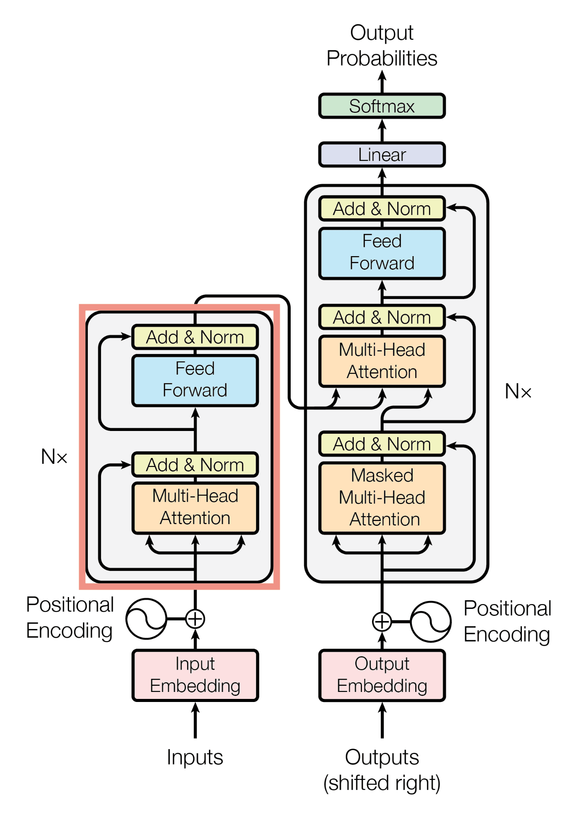

The decoder shares several similarities with the encoder. The decoder also consists of a stack of N = 6 identical layers that are each composed of three sub layers. 

1) The first sublayer receives the previous output of the decoder stack, augments it with positional information and implements multi – head self attention over it. While the encoder is designed to attend to all words in the input sequence regardless of their position in the sequence , the decoder is modified to attend only to the preceding words. Hence , the prediction for a word at position I can only depend on the known outputs for the words that come before it in the sequence.

Question :- 

    • Why do we need positional encoding for the decoder ? 

We need positional encoding for the decoder in the Transformer architecture for the same reason we need it for the encoder , to provide the decoder with information about the relative positions of the input tokens. 

In the Transformer architecture , the decoder generates an output sequence by attending to the encoded input sequence produced by the encoder. To attend to the input sequence correctly , the decoder needs to be aware of the relative positions of the input tokens , so that it can give appropriate weights to each token during the attention process. 

Without positional encoding, the decoder would have no information about the relative positions of the input tokens, and would not be able to perform attention effectively. This could result in poor performance on natural language processing tasks , such as language translation or text classification. 

Therefore, like the encoder, the decoder in the Transformer architecture also uses positional encoding to encode the relative positions of the input tokens. The positional encoding is added to the decoder’s input embeddings before they are fed into the decoder layers , allowing the decoder to attend to the input sequence correctly and generate an appropriate output sequence. 

Question :- 

    • What does masked multi – head attention actually do ?

The masked multi-head attention mechanism in the decoder part of the Transformer architecture allows the decoder to attend to the previously generated tokens in the output sequence , while preventing it from attending to future tokens.

In the Transformer architecture , the decoder generates the output sequence one token at a time , in an auto-regressive manner. This means that at each step , the decoder generates a new token based on the previously generated tokens in the sequence. To generate each token , the decoder attends to the encoded input sequence produced by the encoder , as well as the previously generated tokens in the output sequence. 

However , during training , we do not want the decoder to have access to future tokens in the output sequence , as this would result in data leakage and prevent the model from learning to generate outputs in a sequential and auto regressive manner. To prevent the decoder from attending to future tokens , the masked multi head attention mechanism is used. 

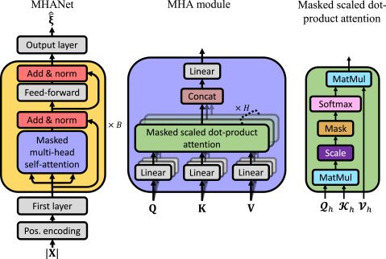  
       
The masked multi head attention mechanism works by masking out the attention scores for future tokens in the output sequence. Specifically , a binary mask is applied to the attention scores such that future tokens are assigned a score of negative infinity , which effectively prevents the decoder from attending to them. This ensures that the decoder can only attend to the previously generated tokens and the encoded input sequence when generating each new token in the output sequence. 

Overall , the masked multi – head attention mechanism is an important component of the Transformer architecture that allows the decoder to generate output sequence in a sequential and auto regressive manner , while also preventing it from attending to future tokens during training. 

2) The second layer implements a multi – head self attention mechanism similar to the one implemented in the first sublayer of the encoder. On the decoder side, this multi – head mechanism receives the queries from the previous decoder sub layer and the keys and the values from the output of the encoder. This allows the decoder to attend to all the words in the input sequence.

Question :- 

    • Why are we receiving the keys and values from the encoder and the queries from the decoder? 

Imagine you're translating a sentence from English to French. You read the English sentence (the input) and start thinking of the French words (the output). The process of translating involves remembering what each English word means and how it relates to the French words you're choosing.
In the Transformer model:
The encoder reads the input sentence (English words) and turns each word into a list of clues (keys) about its meaning.
The decoder starts creating the output sentence (French words). It uses questions (queries) to ask, "Which English word should I pay attention to right now as I choose the next French word?"
So, when the decoder is working on the output, it uses these questions (queries) to look at the list of clues (keys) provided by the encoder. If a question matches a clue very closely, it means that the English word related to that clue is important for deciding the next French word.
In simple terms, the decoder is like a detective asking questions to pick up the right clues from the encoder to solve the mystery of what the next word in the translation should be.

3) The third layer implements a fully connected feed – forward network, similar to the one implemented in the second sub layer of the encoder 

4) The linear layer :- the linear layer in the decoder part of the Transformer serves several purposes:

* Transformation of Dimensions: The linear layer can change the dimensionality of the data it processes. For example, if the multi-head attention outputs a certain size vector, and the next part of the network expects a different size, the linear layer will transform the data to the required size.

* Integration of Information: After the attention mechanism, the model has collected information that's spread out across different representation spaces (since each head in the multi-head attention may focus on different aspects of the input). The linear layer helps to integrate this information into a single, new representation.

* Preparation for Output: In the decoder, the final linear layer's job is to prepare the attention-integrated data for prediction. This usually involves transforming the data to have the same dimension as the vocabulary size used in the model. This is because the output of the linear layer will be the input to the softmax function, which will predict the probability distribution of the next word in the sequence.

* Learning Complex Mappings: Linear layers, especially when combined with activation functions and used in multiple layers, can learn complex mappings from their inputs to their outputs. This allows the model to capture complex relationships in the data, which is essential for tasks like language translation.
In essence, the linear layers in the decoder are there to shape and refine the data at various stages, ensuring it's in the right form for the next processing step and ultimately for making a prediction.

5) The softmax :- The softmax function in the decoder of the Transformer architecture plays a critical role in the final step of generating output, such as a translated word in a sentence. Here's the point of using softmax:

* **Probabilities**: Softmax converts the raw output scores (also known as logits) from the linear layer into probabilities. It ensures that all the output values are positive and sum up to 1, making them a proper probability distribution.

* **Selection of Most Likely Output**: In the context of language tasks, each output score corresponds to a word in the model's vocabulary. The softmax function helps determine which word is the most likely next word in the sequence by assigning the highest probability to it.

* **Differentiability**: Softmax is a differentiable function, which means it allows the use of gradient-based optimization methods. This is crucial during training, as the model needs to adjust its parameters to minimize the difference between the predicted probabilities and the actual distribution of words in the training data.

* **Amplifying Differences**: Softmax amplifies the differences in the logits. Even small differences in the input scores can lead to large differences in the probability distribution. This helps the model to be more decisive in its predictions, making it less likely to be uncertain between multiple choices.
Softmax turns the decoder's output into a clear, probabilistic prediction, allowing the Transformer model to select the most probable next element in the sequence it is generating.

## THE DIMENSION OF THE TRANSFORMER ARCHITECTURE

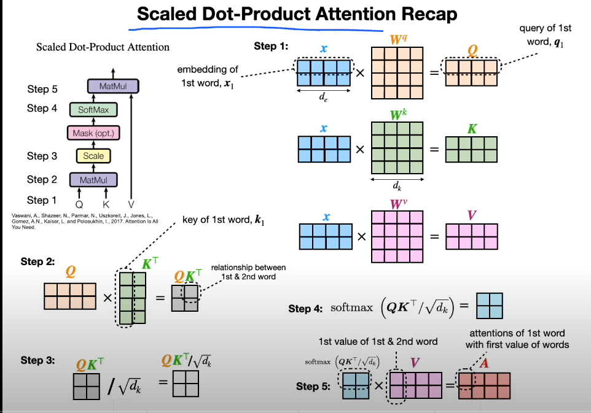

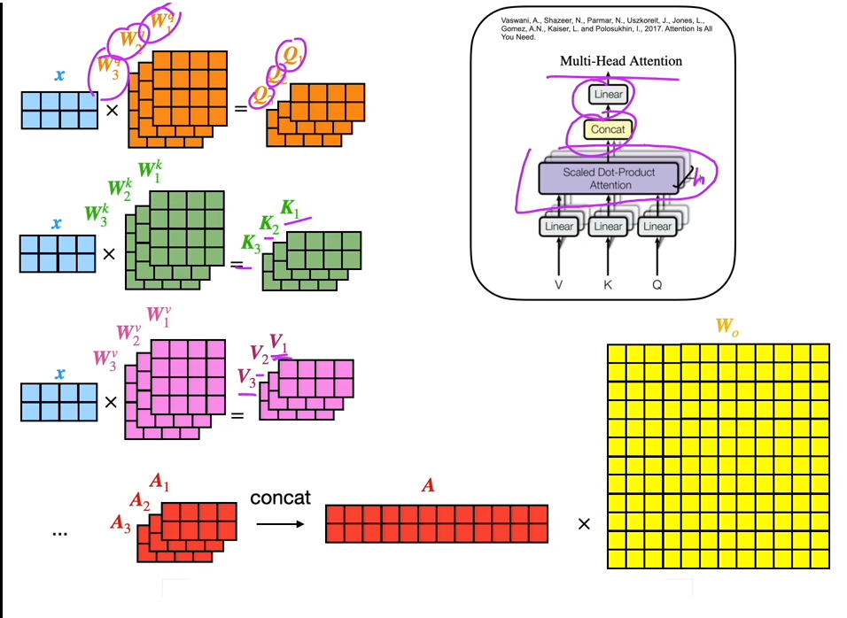

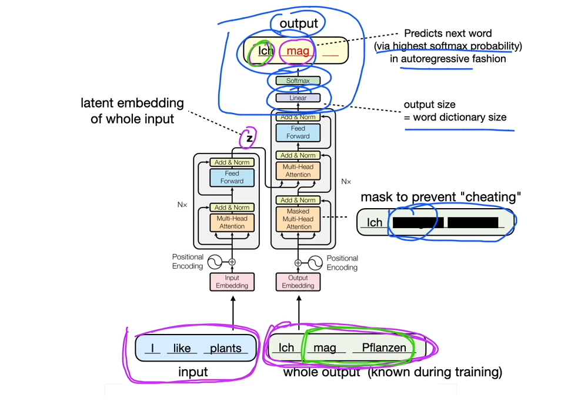

## VISION TRANSFORMER 

The Vision Transformer (ViT) is an adaption of the transformer architecture for computer vision tasks. The ViT applies the self attention mechanism of the Transformer to image patches , allowing the model to attend to different parts of the image and learn long – range dependencies between patches.

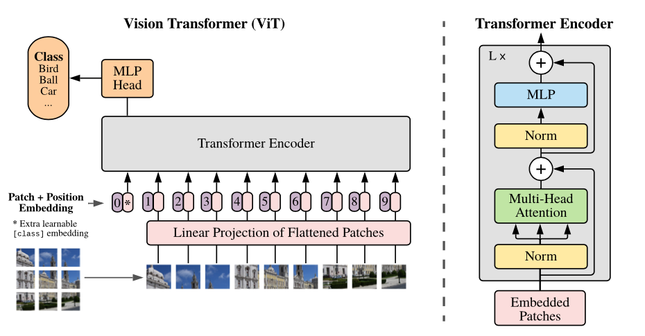

In the ViT , the input image is divided into a grid on non – overlapping patches , which are then flattened and fed into the Transformer encoder. Each patch is treated as a separate token , and the self – attention mechanism is used to compute the relationship between all pairs of patches. This allows the model to learn spatial relationships between different regions of the image , without relying on hand – crafted features or convolutional operations. The ViT has been shown to achieve state of the art results on a range of computer vision tasks , including image classification , object detection and semantic segmentation. By adapting the Transformer architecture to image data , the ViT provides a powerful and flexible approach to computer vision that can capture complex spatial relationships between different parts of an image.

